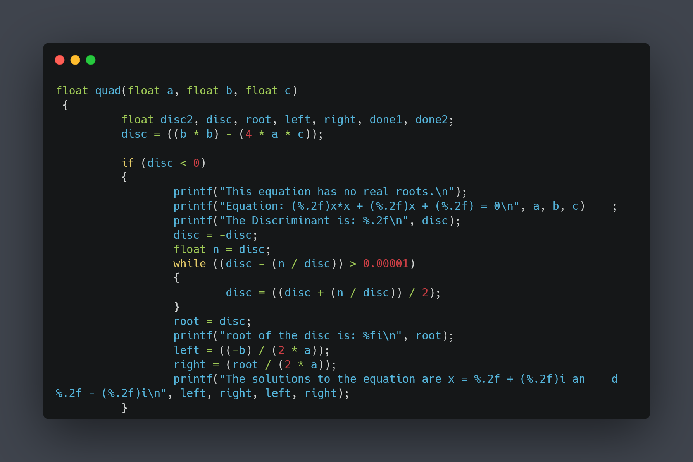

# C Basics practice repository
	


### Included Libraries :scroll:
- stdio.h
- math.h
- unistd.h

### ASCII Table :bookmark_tabs:


## Projects :gem:
### Root
- [0-4loop.c](0-loop.c):
	These files uses basic loops to perform different functions
- [factorial.c](factorial.c):
	User input (integer value) is collected using the `scanf()` function.
- [fixed_square.c](fixed_square.c):
	Finds the square of a number defined in `square = integer_square(7);` this is a fixed value.
- [git-default_acp.sh](git-default_acp.sh):
	Shell script using git commands to add, commit and push when the file is run.
- [higher_base.c](higher_base.c):
	A table showing values in Hex, Octal and Decimal.
- [indentation.c](indentation.c):
	########################################################.
- [integers.c](integers.c):
	Integer and float division.
- [letters.c](letters.c):
	Prints the letters and numbers defined in a char data type.
- [multiples.c](multiples.c):
	Collects user input and prints out all multiples of the input number.
- [multiplication.c](multiplication.c):
	A function `multiply(int x, int y)` finds the product of two numbers.
- [numbers.c](numbers.c):
	Prints a number.
- [putchar.c](putchar.c):
	Uses the function `putchar` to print letters of the alphabet.
- [reading_input.c](reading_input.c):
	Collects user input and displays it.
- [switch.c](switch.c):
	Practicing switch , case, break and continue.
- [writing_output.c](writing_output.c):
	Writes output with putchar.

## Sub-Directories :briefcase:

### [level2](level2/)
- [11L01.c](level2/11L01.c):
	Prints out addresses and content using the address operator `&`.
- [add3.c](level2/add3.c):
	Prints addresses using pointers.
- [arithmetic.c](level2/arithmetic.c):
	Various arithmetic operations.
- [maxint.c](level2/maxint.c):
	Uses the `sizeof()` function to get the size of an integer.
- [strings.c](level2/strings.c)
	Using strings (Strings and character constants, string and character arrays).

### [level3](level3/)
- [arr.c](level3/arr.c):
	Arrays.
- [characterarr.c](level3/characterarr.c):
	Character arrays.
- [quadratic.c](level3/quadratic.c):
	Solves any quadratic equation of the form `ax2 + bx + c = 0`

- [silmultaneous.c](level3/silmultaneous.c):
	This program will solve any silmultaneous equation with two unknowns. (Silmultaneous linear equations only)
- [sort.c](level3/sort.c):
	Sorting an array.
- [squares.c](level3/squares.c):
	This uses a while loop to find the square toot of a number. It is a form of the [Babilonian Method](https://en.wikipedia.org/wiki/Methods_of_computing_square_roots#Babylonian_method).


```commandline
 All commit message "auto commit" is done by shell scripting in git-default_acp.sh file.
 ```
